## Objetivo de Medição 1: Compatibilidade

| Analisar | Descrição |
| :--- | :--- |
| **Para o propósito de** | Avaliar |
| **Com respeito a** | Compatibilidade |
| **Do ponto de vista da** | Comunidade discente |
| **No contexto da** | Operação em produção |

**Tabela 2** - Objetivo de Medição 1: Compatibilidade.

---

### Perguntas e Hipóteses de Medição

**Questão 1 (Sincronia de Dados):**
> Qual é a consistência dos dados do discente entre o Aprender 3 (Web) e o App Moodle?

* **Hipótese 1.1 (H1.1):** O status de conclusão de atividades (marcar como "feita") fica inconsistente entre a plataforma Web e o aplicativo móvel.
* **Hipótese 1.2 (H1.2):** Os arquivos na área "Arquivos privados" não são sincronizados corretamente entre a versão Web e o App.

**Questão 2 (Recursos do Navegador):**
> Qual é a variação no consumo de recursos (CPU/RAM) do Aprender 3 entre diferentes navegadores?

* **Hipótese 2.1 (H2.1):** O consumo de memória RAM do Aprender 3 é visivelmente maior em um navegador (ex: Chrome) comparado a outro (ex: Firefox), atrapalhando o uso de outros programas pelo discente.

**Questão 3 (Notificações de Fórum):**
> Em que medida o discente recebe notificações por e-mail sobre novas postagens em fóruns de discussão subscritos?

* **Hipótese 3.1 (H3.1):** O discente não recebe os e-mails de notificação de novas mensagens em fóruns que acompanha, mesmo com a opção ativada.

**Questão 4 (Calendário Externo):**
> Em que medida o Aprender 3 permite a exportação para calendários externos?

* **Hipótese 4.1 (H4.1):** Os principais serviços de calendário (Google, Outlook) falham ao tentar importar o calendário do Aprender 3 usando o link de subscrição (URL).
* **Hipótese 4.2 (H4.2):** A importação manual (arquivo `.ics`) funciona, mas a importação automática (via link) falha, indicando um problema específico no mecanismo de atualização automática.

**Questão 5 (Compatibilidade de Interação):**
> Qual é a consistência da funcionalidade drag-and-drop entre os navegadores suportados?

* **Hipótese 5.1 (H5.1):** A funcionalidade de "arrastar e soltar" arquivos (ex: envio de tarefas) falha muito mais em navegadores específicos (ex: Firefox, Safari) do que no navegador principal (ex: Chrome).

---

### Critérios de Julgamento da Compatibilidade

Em conformidade com o Estabelecimento de Critérios de Julgamento, são definidos os critérios para o julgamento final da característica **Compatibilidade** como um todo. Os níveis de pontuação das métricas individuais (Excelente, Bom, Regular, Insatisfatório) serão agregados para fornecer um veredito final, conforme a tabela abaixo:

| Julgamento Final | Critério de Agregação |
| :--- | :--- |
| **Aceitável** | No mínimo 70% das métricas avaliadas obtiveram pontuação "Bom" ou "Excelente" E nenhuma métrica obteve pontuação "Insatisfatório". |
| **Parcialmente aceitável** | No mínimo 50% das métricas avaliadas obtiveram pontuação "Regular" ou superior, OU se alguma métrica-chave (ex: M1.1, M3.1) obteve pontuação "Insatisfatório". |
| **Inaceitável** | Mais de 30% das métricas avaliadas obtiveram pontuação "Insatisfatório", indicando falhas sistêmicas na compatibilidade. |

---

### Seleção das Métricas

**Questão 1 (Sincronia de Dados):**

* **Métrica 1.1: Percentual de Discrepância de Status de Conclusão**
    * **Definição:** A porcentagem de atividades que, após serem marcadas como "concluídas" em uma plataforma (Web ou App) e a ação de sincronização ser executada, não refletem essa mudança na outra plataforma.
    * **Fórmula:** (% Discrepância) = (Nº de atividades com status diferente / Nº total de atividades testadas) x 100
    * **Propósito:** Medir a compatibilidade da sincronização do progresso do aluno entre os dois ambientes.
    * **Critérios de Julgamento:**
    
    | Excelente | Bom | Regular | Insatisfatório |
    | :--- | :--- | :--- | :--- |
    | 0% de discrepância | <= 2% de discrepância | 2% a 5% de discrepância | > 5% de discrepância |

* **Métrica 1.2: Taxa de Sucesso de Sincronização Bidirecional de Arquivos**
    * **Definição:** A taxa de sucesso de operações de arquivo (criar, enviar, deletar) na área privada do usuário, testadas em ambas as direções (da Web para o App e do App para a Web).
    * **Fórmula:** Média ( (Sucesso Web-para-App / Total) , (Sucesso App-para-Web / Total) ) x 100
    * **Propósito:** Garantir que os arquivos do usuário estejam consistentes e acessíveis em ambos os locais.
    * **Critérios de Julgamento:**

    | Excelente | Bom | Regular | Insatisfatório |
    | :--- | :--- | :--- | :--- |
    | 100% de sucesso | 98% a 99.9% de sucesso | 90% a 97.9% de sucesso | < 90% de sucesso |

**Questão 2 (Recursos do Navegador):**

* **Métrica 2.1: Consumo Médio de RAM por Navegador**
    * **Definição:** A média de memória RAM (em Megabytes) usada pelo navegador após executar um cenário de teste padrão (ex: logar, abrir um curso, rolar a página).
    * **Fórmula:** Média(RAM)_Browser A vs Média(RAM)_Browser B vs Média(RAM)_Browser C
    * **Propósito:** Avaliar o impacto de desempenho da plataforma em diferentes navegadores.
    * **Critérios de Julgamento:** (Baseado na variação entre o navegador mais leve e o mais pesado)

    | Excelente | Bom | Regular | Insatisfatório |
    | :--- | :--- | :--- | :--- |
    | Variação < 15% | Variação de 15% a 30% | Variação de 30% a 50% | Variação > 50% |

**Questão 3 (Notificações de Fórum):**

* **Métrica 3.1: Taxa de Falha de Entrega de Notificação**
    * **Definição:** A porcentagem de novas postagens em fóruns que não geraram um e-mail de notificação para o usuário após a execução do serviço de envio de mensagens do Moodle.
    * **Fórmula:** (Nº de postagens que NÃO geraram e-mail / Nº total de postagens de teste) x 100
    * **Propósito:** Verificar a compatibilidade do sistema de alertas por e-mail, que é vital para a comunicação.
    * **Critérios de Julgamento:**

    | Excelente | Bom | Regular | Insatisfatório |
    | :--- | :--- | :--- | :--- |
    | 0% de falha | <= 1% de falha | 1% a 5% de falha | > 5% de falha |

**Questão 4 (Calendário Externo):**

* **Métrica 4.1: Taxa de Falha de Subscrição de URL (Interoperabilidade)**
    * **Definição:** A taxa de falha ao tentar adicionar o calendário do Aprender 3 em serviços de terceiros (Google, Outlook) usando o link de subscrição dinâmico (URL).
    * **Fórmula:** (Nº de tentativas de subscrição que falharam / Nº total de tentativas) x 100
    * **Propósito:** Validar se o link de calendário automático é compatível com os serviços mais populares.
    * **Critérios de Julgamento:** (Baseado no % de serviços testados que falharam)

    | Excelente | Parcial | Insatisfatório |
    | :--- | :--- | :--- |
    | 0% de falha (Funciona em todos) | 50% de falha (Ex: Funciona no Google, falha no Outlook) | 100% de falha (Não funciona em nenhum) |

* **Métrica 4.2: Diferencial de Sucesso (Importação Estática vs. Dinâmica)**
    * **Definição:** Uma métrica que compara a taxa de sucesso da importação manual (arquivo .ics) com a taxa de sucesso da subscrição automática (link URL).
    * **Fórmula:** (% Sucesso Importação Manual .ics) - (% Sucesso Subscrição URL)
    * **Propósito:** Diagnosticar se as falhas (H4.2) estão na geração dos dados (no arquivo .ics) ou no mecanismo que fornece o link dinâmico.
    * **Critérios de Julgamento:** (Resultado binário que valida ou refuta a H4.2)

    | Hipótese Refutada (Resultado Ideal) | Hipótese Validada (Problema Encontrado) |
    | :--- | :--- |
    | Diferencial = 0% (URL funciona tão bem quanto o arquivo) | Diferencial > 0% (Manual funciona, mas URL falha) |

**Questão 5 (Compatibilidade de Interação):**

* **Métrica 5.1: Taxa de Sucesso de Drag-and-Drop (D&D) por Navegador**
    * **Definição:** A porcentagem de tentativas de "arrastar e soltar" arquivos que funcionam corretamente na área de envio de tarefas, medida para cada navegador.
    * **Fórmula:** (% Sucesso D&D) = (Nº de uploads via D&D bem-sucedidos / Nº total de tentativas D&D) x 100
    * **Propósito:** Medir a consistência da interface de usuário, garantindo que formas de interação essenciais funcionem para todos.
    * **Critérios de Julgamento:**

    | Excelente | Bom | Regular | Insatisfatório |
    | :--- | :--- | :--- | :--- |
    | 100% de sucesso em todos os navegadores | 100% no Chrome e Firefox; >95% no Safari | 100% no Chrome; falhas notáveis (50-95%) nos demais | Falha total (< 50%) em qualquer navegador |

---

## Diagrama GQM - (Representação Estrutural)

