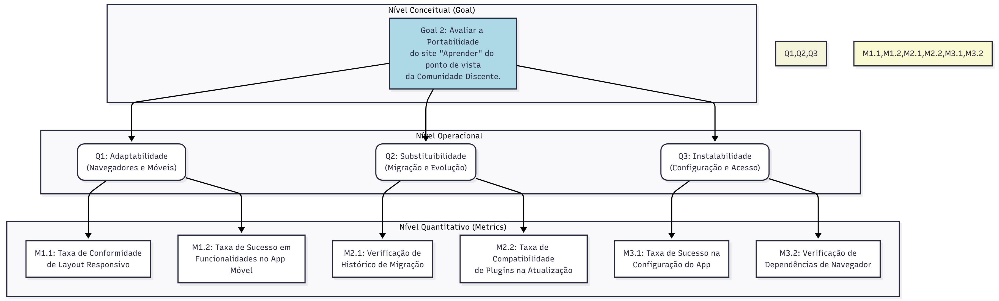

# Portabilidade

## Objetivo de Medição 2: Portabilidade

**Tabela 2** - Objetivo de Medição 2: Portabilidade.

| **Analisar** | o site "Aprender". |
|:---|:---|
| **Para o propósito de**| Avaliar |
| **Com respeito a** | Portabilidade |
| **Do ponto de vista da** | Comunidade discente |
| **No contexto da** | Universidade de Brasília |

---

### Perguntas e Hipóteses de Medição

**Questão 1: (Adaptabilidade)**
> A tecnologia usada no desenvolvimento do site garante que ele funcione corretamente nos navegadores mais populares e até em dispositivos móveis?

* **Hipótese 1.1 (H1.1):** O layout responsivo do Aprender 3 se ajusta adequadamente a diferentes tamanhos de tela, e diferentes navegadores, garantindo sua usabilidade.
* **Hipótese 1.2 (H1.2):** O acesso via aplicativo oficial do Moodle oferece uma alternativa viável e funcional ao navegador, ampliando a portabilidade para o ecossistema móvel.

**Questão 2: (Substituibilidade)**
> A arquitetura do Aprender 3 facilita a evolução do sistema, como a migração de dados de versões anteriores e a atualização de seus componentes?

* **Hipótese 2.1 (H2.1):** A migração bem-sucedida do Aprender para o Aprender 3 evidencia a capacidade da plataforma de ser substituída por versões mais novas, mantendo a continuidade dos serviços.
<!-- * **Hipótese 2.2 (H2.2):** A natureza modular do Moodle permite a atualização e substituição de componentes (plugins e temas), garantindo sua evolução tecnológica e funcional. -->

**Questão 3: (Instalabilidade)**
> O acesso ao Aprender 3, seja via aplicativo móvel ou navegador, pode ser configurado sem a necessidade de conhecimentos técnicos avançados?

* **Hipótese 3.1 (H3.1):** A configuração do aplicativo Moodle para conectar-se ao site da UnB (`aprender3.unb.br`) é um processo complexo, causando dificuldades para usuários não técnicos.
* **Hipótese 3.2 (H3.2):** O sistema não impõe a instalação de plugins ou softwares específicos no navegador do usuário para seu funcionamento básico, garantindo a portabilidade entre diferentes máquinas e perfis de permissão.

---

### Critérios de Julgamento da Característica (Portabilidade)

Em conformidade com Estabelecimento de Critérios de Julgamento, são definidos os critérios para o julgamento final da característica **Portabilidade** como um todo. Os níveis de pontuação das métricas individuais (Excelente, Bom, Regular, Insatisfatório) serão agregados para fornecer um veredito final, conforme a tabela abaixo:

| Julgamento Final | Critério de Agregação |
| :--- | :--- |
| **Aceitável** | No mínimo 70% das métricas avaliadas obtiveram pontuação "Bom" ou "Excelente" E nenhuma métrica obteve pontuação "Insatisfatório". |
| **Parcialmente aceitável** | No mínimo 50% das métricas avaliadas obtiveram pontuação "Regular" ou superior, OU se alguma métrica-chave (ex: M1.1, M3.1) obteve pontuação "Insatisfatório". |
| **Inaceitável** | Mais de 30% das métricas avaliadas obtiveram pontuação "Insatisfatório", indicando falhas sistêmicas na portabilidade. |

---

### Seleção das Métricas

**Questão 1: (Adaptabilidade)**

* **Métrica 1.1: Taxa de Conformidade de Layout Responsivo**
    * **Definição:** A porcentagem de páginas e funcionalidades essenciais que são renderizadas corretamente, sem quebras de layout ou perda de funcionalidade, em diferentes resoluções de tela e navegadores.
    * **Fórmula:** (% Conformidade) = (Nº de páginas/funcionalidades conformes / Nº total de páginas/funcionalidades testadas) x 100
    * **Coleta:**
        1. Definir uma lista de N páginas e funcionalidades críticas (ex: login, página inicial do curso, fórum, envio de tarefa).
        2. Definir os ambientes de teste: Navegadores (Chrome, Firefox, Safari) e Resoluções (Desktop, Tablet, Smartphone).
        3. Para cada ambiente, executar o checklist de funcionalidades, registrando sucesso ou falha (ex: elemento sobreposto, botão inacessível).
    * **Propósito:** Garantir que a experiência do usuário seja consistente e funcional, independentemente do dispositivo ou navegador utilizado.
    * **Critérios de Julgamento:**

    | Excelente | Bom | Regular | Insatisfatório |
    | :--- | :--- | :--- | :--- |
    | > 90% de conformidade | 75% a 90% de conformidade | 60% a 74% de conformidade | < 60% de conformidade |

* **Métrica 1.2: Taxa de Sucesso em Funcionalidades no App Móvel**
    * **Definição:** A porcentagem de tarefas essenciais que podem ser concluídas com sucesso através do aplicativo oficial do Moodle.
    * **Fórmula:** (% Sucesso no App) = (Nº de tarefas bem-sucedidas no App / Nº total de tarefas testadas) x 100
    * **Coleta:**
        1. Definir um checklist de tarefas críticas (ex: visualizar notas, enviar uma mensagem, responder a um fórum).
        2. Instalar o App Moodle em um dispositivo de teste (Android ou iOS).
        3. Tentar executar cada tarefa do checklist, registrando sucesso ou falha.
    * **Propósito:** Validar se o aplicativo móvel é uma alternativa viável e funcional ao navegador, confirmando a portabilidade para o ecossistema móvel.
    * **Critérios de Julgamento:**

    | Excelente | Bom | Regular | Insatisfatório |
    | :--- | :--- | :--- | :--- |
    | > 90% de sucesso | 75% a 90% de sucesso | 60% a 74% de sucesso | < 60% de sucesso |

**Questão 2: (Substituibilidade)**

* **Métrica 2.1: Verificação de Histórico de Migração**
    * **Definição:** Uma métrica binária (Sim/Não) que verifica se a plataforma já passou por um processo de atualização de versão majoritária com sucesso.
    * **Fórmula:** N/A (Verificação qualitativa)
    * **Coleta:**
        1. Pesquisar em notícias, comunicados da UnB ou documentação interna sobre a transição de sistemas anteriores (ex: Aprender 2) para o Aprender 3.
        2. Registrar a existência (Sim) ou ausência (Não) de evidências de uma migração bem-sucedida.
    * **Propósito:** Confirmar, com base em evidências passadas, a capacidade da plataforma de ser substituída por versões mais novas.
    * **Critérios de Julgamento:**

    | Hipótese Validada | Hipótese Refutada |
    | :--- | :--- |
    | Sim (evidência encontrada) | Não (nenhuma evidência) |

<!-- * **Métrica 2.2: Taxa de Compatibilidade de Plugins na Atualização**
    * **Definição:** A porcentagem de plugins e temas instalados que são oficialmente compatíveis com a versão mais recente do Moodle disponível.
    * **Fórmula:** (% Compatibilidade de Plugins) = (Nº de plugins compatíveis / Nº total de plugins instalados) x 100
    * **Coleta:**
        1. Listar todos os plugins e temas de terceiros instalados na versão atual do Aprender 3.
        2. Consultar o diretório oficial de plugins do Moodle para verificar a compatibilidade de cada um com a versão-alvo da atualização.
        3. Registrar o número de plugins compatíveis.
    * **Propósito:** Avaliar a manutenibilidade e a capacidade de evolução da plataforma, medindo a dependência de componentes que podem se tornar obsoletos.
    * **Critérios de Julgamento:**

    | Excelente | Bom | Regular | Insatisfatório |
    | :--- | :--- | :--- | :--- |
    | > 90% compatíveis | 75% a 90% compatíveis | 60% a 74% compatíveis | < 60% compatíveis | -->

**Questão 3: (Instalabilidade)**

* **Métrica 3.1: Taxa de Sucesso na Configuração do App por Novos Usuários**
    * **Definição:** A porcentagem de usuários sem experiência prévia que conseguem instalar e configurar o aplicativo Moodle para acessar o Aprender 3 sem assistência.
    * **Fórmula:** (% Sucesso na Configuração) = (Nº de usuários bem-sucedidos / Nº total de usuários testados) x 100
    * **Coleta:**
        1. Selecionar um grupo de N usuários de teste sem conhecimento prévio do processo.
        2. Fornecer a instrução: "Instale o aplicativo Moodle e acesse sua conta do Aprender 3".
        3. Observar o processo e registrar se o usuário conseguiu completar a tarefa sem ajuda.
    * **Propósito:** Medir a complexidade real do processo de configuração inicial para um usuário comum, avaliando a portabilidade da instalação.
    * **Critérios de Julgamento:**

    | Excelente | Bom | Regular | Insatisfatório |
    | :--- | :--- | :--- | :--- |
    | > 90% de sucesso | 75% a 90% de sucesso | 60% a 74% de sucesso | < 60% de sucesso |

* **Métrica 3.2: Verificação de Dependências de Navegador**
    * **Definição:** Uma métrica binária (Sim/Não) que verifica se o funcionamento básico do Aprender 3 requer a instalação de qualquer software, plugin ou extensão de navegador de terceiros.
    * **Fórmula:** N/A (Verificação qualitativa)
    * **Coleta:**
        1. Utilizar um navegador em sua configuração padrão ("limpa"), sem extensões.
        2. Executar um checklist de funcionalidades essenciais (ex: login, visualização de conteúdo, envio de tarefa).
        3. Registrar se alguma funcionalidade exigiu a instalação de um componente adicional (Não) ou se tudo funcionou nativamente (Sim).
    * **Propósito:** Garantir que a plataforma seja facilmente portável entre diferentes computadores (pessoais, laboratórios, etc.) sem barreiras de instalação.
    * **Critérios de Julgamento:**

    | Excelente (Portável) | Insatisfatório (Não Portável) |
    | :--- | :--- |
    | Sim (nenhuma dependência) | Não (requer instalação) |

---

## Diagrama GQM - (Representação Estrutural)

