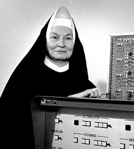

# Grupo Irmã Mary Kenneth Keller - Turma 2 (2025.2)

## Sobre o Projeto

Esta página documenta os artefatos desenvolvidos pelo Grupo Irmã Mary Kenneth Keller no segundo semestre de 2025, na disciplina de **Qualidade de Software** da Faculdade de Ciências e Tecnologias em Engenharia da Universidade de Brasília (FCTE-UnB).

O projeto tem como objetivo aplicar técnicas, normas e boas práticas de qualidade de software, realizando uma análise do **Aprender 3** com base em critérios estabelecidos pela norma ISO/IEC 25010 (SQuaRE).

## Figura 1 — Irmã Mary Kenneth Keller

  
  
<b>Fonte:</b> Wikipedia

## Quem foi a Irmã Mary Kenneth Keller

Irmã Mary Kenneth Keller foi uma religiosa católica, educadora e pioneira da computação. Em 1965, tornou-se a primeira mulher a obter um doutorado em Ciência da Computação nos Estados Unidos, pela Universidade de Wisconsin Madison. Na mesma data, Irving C. Tang recebeu o primeiro D.Sc. em Ciência da Computação, razão pela qual ambos são frequentemente citados como os primeiros doutores da área no país [1][2].

Após o doutorado, Keller fundou o Departamento de Ciência da Computação no Clarke College (atual *Clarke University*), em Dubuque, Iowa, e o dirigiu por quase duas décadas, tornando o programa um dos primeiros de uma instituição pequena nos EUA [3][4].

Keller foi defensora do acesso democrático à computação, especialmente na educação, e profetizou o papel da área em inteligência artificial:  
*“Pela primeira vez, podemos simular mecanicamente o processo cognitivo, podemos realizar estudos em inteligência artificial.”* [1]

## Formação e trajetória acadêmica

- Bacharelado (1943) e Mestrado (1952) em Matemática, pela DePaul University [1][5].  
- Estudos de pós-graduação e estágios em Purdue, University of Michigan e Dartmouth College; em Dartmouth, foi aberta uma exceção à regra de não admitir mulheres no laboratório de computação para que ela atuasse no centro [1].  
- Doutorado (1965) na UW Madison, com a tese *Inductive Inference on Computer Generated Patterns* [2].  
- Clarke College: criação e consolidação do departamento, forte atuação para ampliar infraestrutura e inclusão de mulheres e mães estudantes [1][3].

---

## Referências

> [1] On Wisconsin Magazine. *On, Alumnae: Mary Kenneth Keller*. University of Wisconsin Madison Alumni Magazine, 2019.  
> [2] Wikipedia (en). *Mary Kenneth Keller* dados biográficos, tese e contexto histórico.  
> [3] Clarke University. *Quick Facts* histórico do programa de Computação e menções ao legado de Keller.  
> [4] Head, J., O’Leary, D. P. *The Legacy of Mary Kenneth Keller, First U.S. Ph.D. in Computer Science*. *IEEE Annals of the History of Computing*, 45(1), 55-63, 2023.  
> [5] DePaul University. *Sister Mary Kenneth Keller, Faces of DePaul*, formação de graduação e mestrado.  

---

## Equipe

<table>
  <tr>
    <td align="center">
      <a href="https://github.com/Fhansen98">
        
         <b>Felipe Hansen</b>
      </a>
    </td>
    <td align="center">
      <a href="https://github.com/patrickacs">
        
         <b>Patrick Anderson</b>
      </a>
    </td>
    <td align="center">
      <a href="https://github.com/PedroSampaioDias">
        
         <b>Pedro Sampaio</b>
      </a>
    </td>
    <td align="center">
      <a href="https://github.com/taybalau">
        
         <b>Taynara Gabrielle</b>
      </a>
    </td>
    <td align="center">
      <a href="https://github.com/thalesgvl">
        
         <b>Thales Germano</b>
      </a>
    </td>
    <td align="center">
      <a href="https://github.com/yagoas">
        
         <b>Yago Amin</b>
      </a>
    </td>
  </tr>
</table>

## Histórico de Versões

|Versão|Data|Descrição|Autor|
|:----:|----|---------|-----|
| `1.0` | 28/09/2025 | Criação da página inicial | [Pedro Sampaio](https://github.com/PedroSampaioDias) |
| `1.1` | 29/09/2025 | Revisão e padronização de links | [Yago Amin](https://github.com/yagoas) |  
